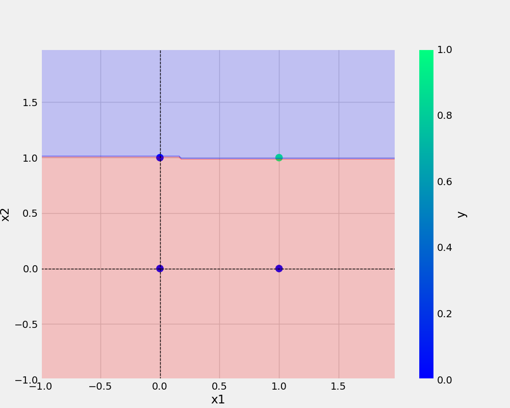

# oneNeuron
oneNeuron Perceptron

# commands used- 
'''bash

git add . && git commit -m"Message" && git push origin main

## Add URL-
[Git Handbook](https://docs.github.com/en/get-started/using-git/about-git)

## Add Image - 
